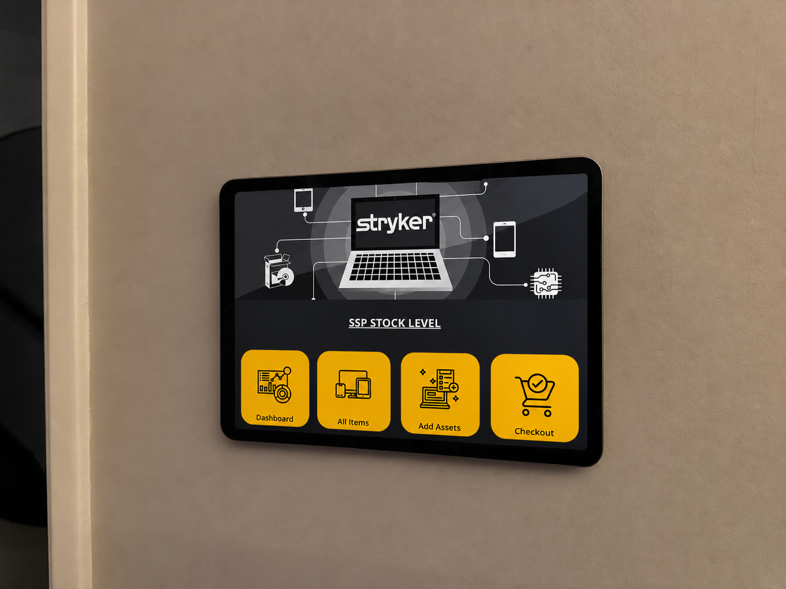
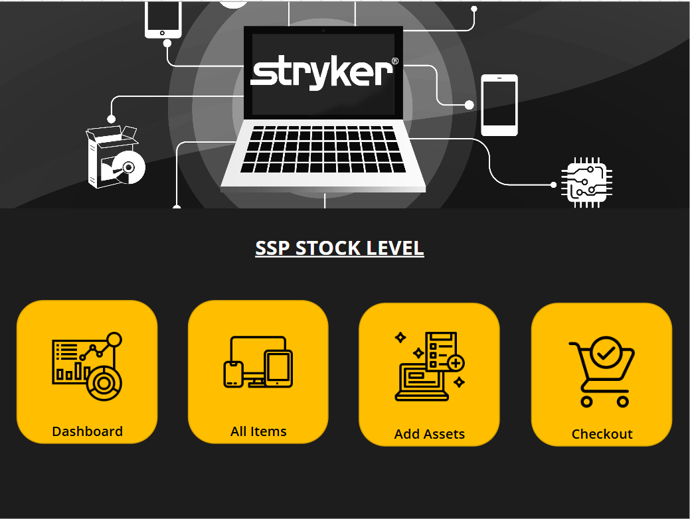
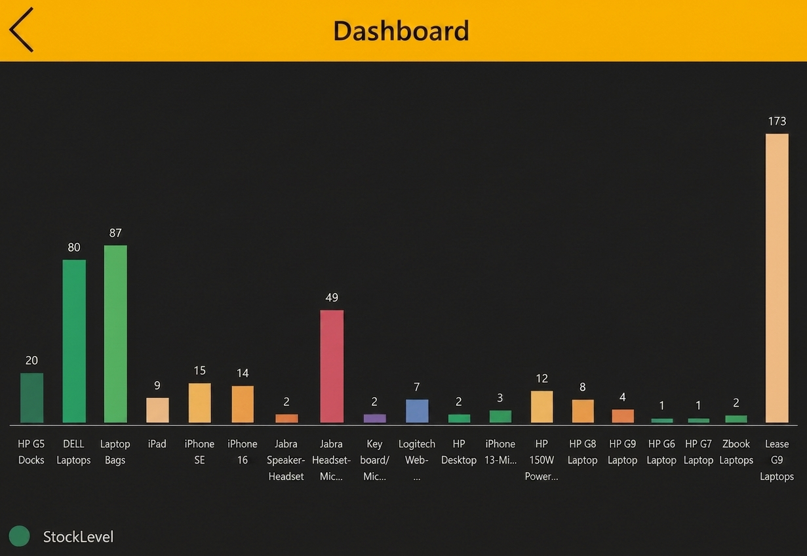
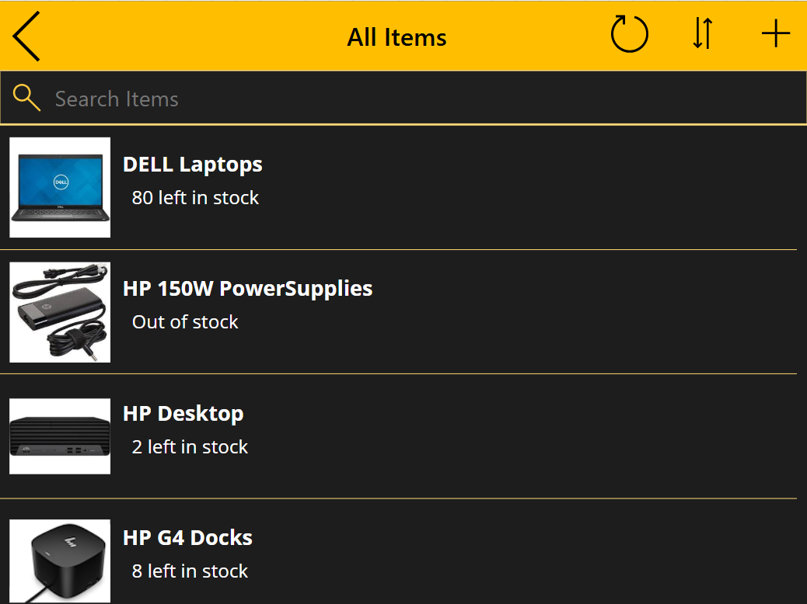
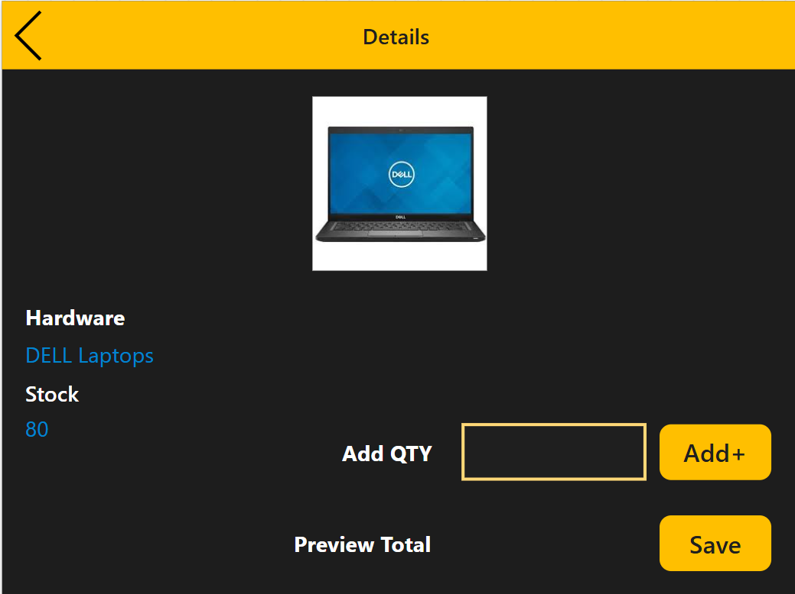
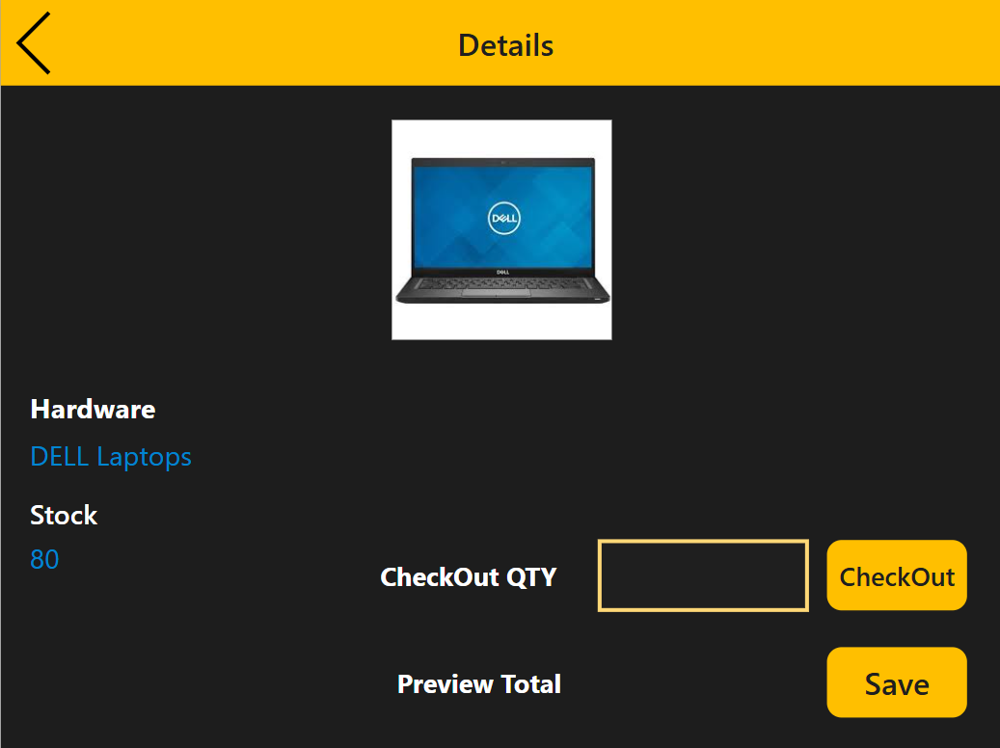
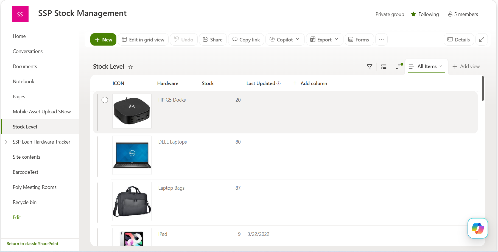

# Storeroom Stock Count (SSP Stock Level)

A Power App used directly on an iPad in the storeroom to track live hardware stock levels — replacing manual physical counts with real-time, on-the-spot updates.

## Problem

Before this app, checking stock levels meant physically counting every item in the storeroom — laptops, docks, monitors, cables, and other hardware — every time an accurate count was needed. This was slow, repetitive, and pulled time away from other IT support work. The SharePoint list behind it existed, but updating it directly from a browser wasn't practical for someone standing in the storeroom with hardware in hand.

## Solution

The app runs on an iPad kept in the storeroom, so stock can be updated the moment hardware moves — no separate counting session required. The home screen has four actions:

- **Dashboard** — a live bar chart of stock levels across every hardware category (laptops, docks, bags, monitors, headsets, etc.), so the current state of the room is visible at a glance.
- **All Items** — a searchable, scrollable,filterable list of every hardware type with its current stock count (e.g. "80 left in stock", "Out of stock").
- **Add Assets** — select an item, enter a quantity, and add it to stock (e.g. new hardware delivered).
- **Checkout** — select an item, enter a quantity, and deduct it from stock (e.g. hardware issued to a user or moved out of the room).

Both Add and Checkout screens show the item's current stock and a live preview total before saving, so the count updates immediately and accurately.

## Tech Used

- **Power Apps** (canvas app) — Dashboard, All Items, Add Assets, and Checkout screens
- **SharePoint list** ("Stock Level") — single source of truth for hardware and quantities, updated live by the app
- **Device:** iPad, kept on-site in the storeroom for immediate updates at the point of use

## Impact

- Eliminated manual physical stock counts — counts are now always current instead of needing to be recalculated on demand
- Faster and simpler to update stock from the app on an iPad than editing the SharePoint list directly
- Gives an accurate, real-time view of storeroom inventory at any time, without interrupting other work to go count

## Screenshots

### Homepage

### Dashboard

### All Items

### Add Assets

### Checkout

### Sharepoint List (Data Source)

