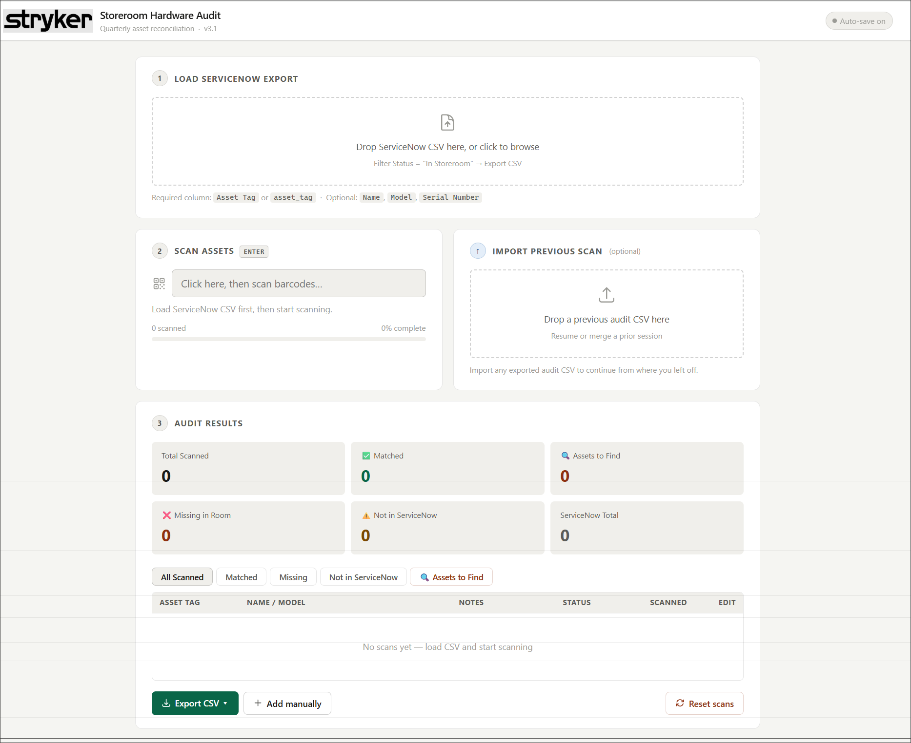
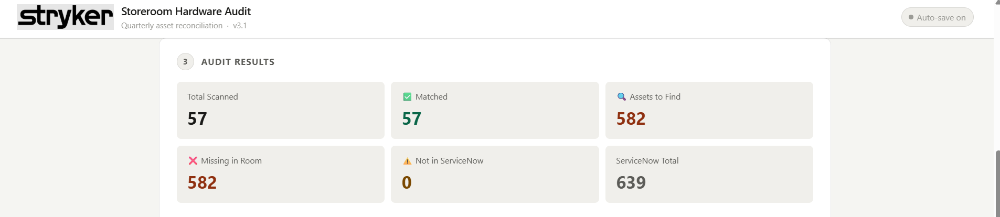
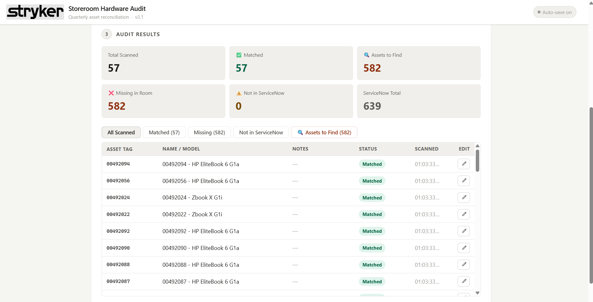
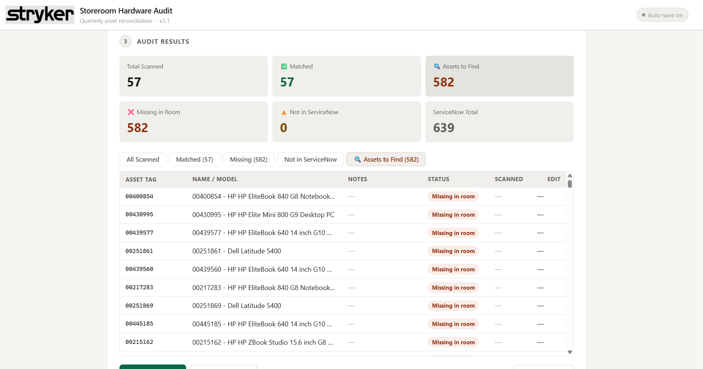
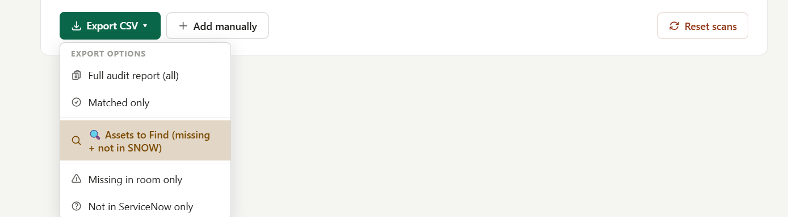

# Storeroom Hardware Audit

A web app for reconciling physical storeroom hardware (laptops, desktops) against ServiceNow asset records — turning a manual, hours-long audit of 400-500+ assets into a fast scan-and-compare workflow.

## Problem

Quarterly asset reconciliation meant manually checking every laptop and desktop in the storeroom against what ServiceNow listed as "in stock." With 400-500+ assets to get through each time, this was almost entirely manual — slow, tedious, and easy to lose track of what had and hadn't been checked yet.

## Solution

The workflow now runs in three steps directly in the app:

1. **Load ServiceNow export** — export the ServiceNow "In Storeroom" asset list as a CSV and drop it into the app.
2. **Scan assets** — walk the storeroom with a handheld barcode scanner, scanning each physical asset tag directly into the app.
3. **Review audit results** — the app automatically compares scanned assets against the ServiceNow export and sorts everything into a live dashboard:
   - **Matched** — asset is in both ServiceNow and the room
   - **Missing in Room** — listed in ServiceNow but not found during the physical scan
   - **Not in ServiceNow** — scanned in the room but not on the ServiceNow list
   - **Assets to Find** — combined missing + not-in-ServiceNow, the actual follow-up list

Results can be exported as CSV in several formats (full report, matched only, assets to find, missing only, not in ServiceNow only) to support the investigation into missing assets afterward. A previous scan session can also be imported to resume or merge an in-progress audit.

## Tech Used

- Web app (HTML/JS), built and customized with Claude AI assistance
- CSV import/export for ServiceNow data and audit results
- Handheld barcode scanner for direct asset-tag input
- Client-side matching logic to reconcile scanned assets against the ServiceNow export

## Impact

- Cuts audit time dramatically — what used to be a fully manual check of 400-500+ assets is now a scan-and-compare process
- Removes manual cross-referencing between spreadsheets/ServiceNow and a physical count
- Presents results in a clear dashboard (Total Scanned, Matched, Missing, Not in ServiceNow) instead of a raw list, making follow-up on missing assets much faster
- Exportable, filtered CSVs make it easy to hand off exactly the list needed (e.g. just "Assets to Find") for investigation

## Screenshots
---
### Dashboard

### Matched Assets

### Assets to Find

### Export Options

